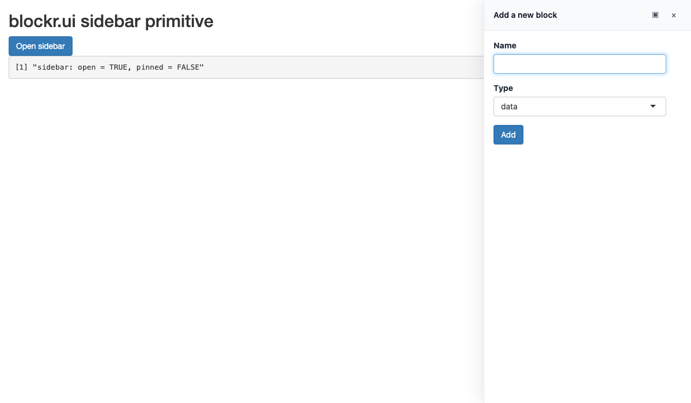

<!-- README.md is generated from README.Rmd. Please edit that file -->

```{r, include = FALSE}
knitr::opts_chunk$set(
  collapse = TRUE,
  comment = "#>",
  fig.path = "man/figures/README-",
  out.width = "100%"
)
```

# blockr.ui

<!-- badges: start -->
[](https://lifecycle.r-lib.org/articles/stages.html#experimental)
[](https://github.com/BristolMyersSquibb/blockr.ui/actions/workflows/ci.yaml)
[](https://app.codecov.io/gh/BristolMyersSquibb/blockr.ui)
[](https://CRAN.R-project.org/package=blockr.ui)
<!-- badges: end -->

User-interface primitives shared across the
[blockr](https://blockr.site/) ecosystem. Designed to sit between
`blockr.core` and renderers such as `blockr.dock`.

## Installation

You can install the development version of blockr.ui from
[GitHub](https://github.com/BristolMyersSquibb/blockr.ui) with:

``` r
# install.packages("pak")
pak::pak("BristolMyersSquibb/blockr.ui")
```

## Example

```{r minimal-example, eval=FALSE, code=readLines("inst/examples/minimal/app.R")}
```

```{r minimal-screenshot, echo=FALSE, eval=TRUE, message=FALSE, warning=FALSE, results='hide'}
# Drive an "open sidebar" click via shinytest2 so the screenshot
# captures the panel in its open state. Mirrors blockr.dock's README
# convention (NOT_CRAN unblocks shinytest2's CRAN guard during build).
withr::local_envvar(NOT_CRAN = "true")
app <- shinytest2::AppDriver$new(
  system.file("examples", "minimal", package = "blockr.ui"),
  width = 1200,
  height = 700
)
Sys.sleep(2)
app$run_js("document.getElementById('open').click()")
Sys.sleep(0.8)
tmp <- tempfile(fileext = ".png")
app$get_screenshot(tmp)
file.copy(tmp, "man/figures/sidebar-minimal.png", overwrite = TRUE)
app$stop()
```



## Code of Conduct

Please note that the blockr.ui project is released with a
[Contributor Code of Conduct](https://contributor-covenant.org/version/2/1/CODE_OF_CONDUCT.html).
By contributing to this project, you agree to abide by its terms.
