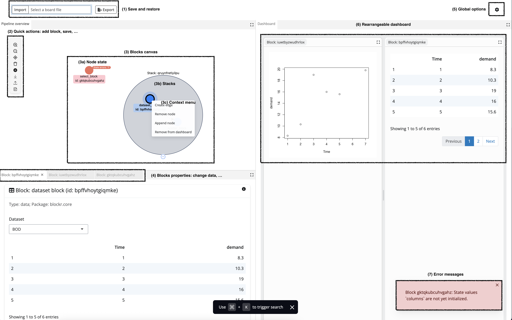

<!-- README.md is generated from README.Rmd. Please edit that file -->

# blockr.ui

<!-- badges: start -->

[](https://lifecycle.r-lib.org/articles/stages.html#experimental)
[](https://github.com/cynkra/blockr.ui/actions/workflows/ci.yml)
[](https://CRAN.R-project.org/package=blockr.ui)
[](https://app.codecov.io/gh/cynkra/blockr.ui)
<!-- badges: end -->

The goal of `blockr.ui` is to provide an alternative user interface for
[`blockr.core`](https://bristolmyerssquibb.github.io/blockr.core/). With
`blockr.ui` you can create, edit and run **data analysis** pipelines in
a user-friendly way with point and click and drag and drop actions. It
builds on top of the blockr ecosystem, which provides building
[blocks](https://github.com/BristolMyersSquibb/blockr.core/?tab=readme-ov-file#extending-blockr)
from data import to data manipulation and visualisation with R. The code
is reproducible and pipelines can be saved and shared with
collaborators. Finally, `blockr.ui` is designed to be extensible, so you
can add your own blocks or add extra
[modules](https://bristolmyerssquibb.github.io/blockr.ui/articles/app-modules.html)
to it.

## Installation

You can install the development version of blockr.ui from
[GitHub](https://github.com/) with:

``` r
pak::pak("BristolMyersSquibb/blockr.ui")
```

## Example

To run the demo app:

``` r
library(blockr.ui)
library(blockr.dplyr)
library(blockr.sdtm)
library(blockr.io)

run_demo_app()
```

## User interface

That’s how `blockr.ui` looks like. We strived to make it as simple as
possible, yet with a totally flexible layout. All panels can be resized
and rearranged to your liking.



1)  The top navigation bar contains buttons to import or export any
    existing work you did before.

2)  The left pipeline panel has a **toolbar** which exposes quick
    actions such as:

    - adding a new block.
    - Removing a set of selected blocks.
    - Saving the current work.
    - Restore a previous state.
    - Zoom in or out on the network.
    - …

3)  In the center of the panel is displayed the current blockr pipeline
    where **blocks** are represented as **nodes** and connections as
    **edges**. In our example, we have 1 invalid **block** which
    **state** is depicted as orange. The reason is explained in the
    bottom right corner of the UI where **error** messages are displayed
    (in this specific case, the block is missing input data). Blocks can
    be grouped together within **stacks**, as shown with the grey
    circle. This is convenient as stacks can be collapsed or expanded,
    thereby saving significant amount of space in the UI. You can also
    drag and drop nodes in or out of a stack to add/remove them,
    respectively. Pretty much all elements on the canvas have a right
    click action, also known as a **context menu**. For example,
    right-clicking on a node will show you options to remove it, add
    another node right after, connect it to another node or add/remove
    it in the right side dashboard. Right clicking on the canvas will
    show you options to add a new block or add a new stack. These
    actions can be customised as explained in the following
    [vignette](https://bristolmyerssquibb.github.io/blockr.ui/articles/app-modules.html).

4)  The bottom right corner hosts the **properties** panels. It displays
    the properties of the any existing block. They can be closed but
    reappear if you click on the corresponding node in the graph. You
    can edit these properties directly in the UI, like changing the
    currently selected data. In future releases, you will be able to
    change the block name and more.

5)  You may control **global options** from the top right corner. This
    opens a menu where some options can be changed, such as the current
    theme, the dashboard zoom, …

6)  The right side **dashboard** is a place to add blocks outputs such
    as plots, tables or any other output that can be produced by a
    block. You can add blocks to the dashboard by right-clicking on them
    and selecting “Add to dashboard” and remove them by right-clicking
    on the dashboard output and selecting “Remove from dashboard”. The
    dashboard can be resized and each panel can be dragged to rearrange
    the layout.

7)  The bottom left corner displays the current pipeline **error logs**.

## App options

There are few **options** you can customize through setting up
environment variables:

- `N_STACKS_COLORS`: how many colors to support in the stack color
  pickerInput. Default is 40.
- `STACKS_COLOR_PALETTE`: the color palette type. Default is `spectral`.
  We use `hcl.colors` to setup the palette.
- `SNAPSHOT_LOCATION`: The location where to save the snapshots of the
  blocks. Default is `tempdir()`. This is used to save the blocks in the
  browser’s local storage.
- `AUTO_SNAPSHOT`: Whether to automatically save the blocks in the
  browser’s local storage. Default is `FALSE` (not stable at the
  moment).

## Development

JS code is managed by `esbuild`
[`{charpente}`](https://github.com/RinteRface/charpente?tab=readme-ov-file#using-esbuild-and-mocha).
To create a new JS file do and compile the entire project:

``` r
charpente::create_js("file-name")
charpente::build_js()
```
