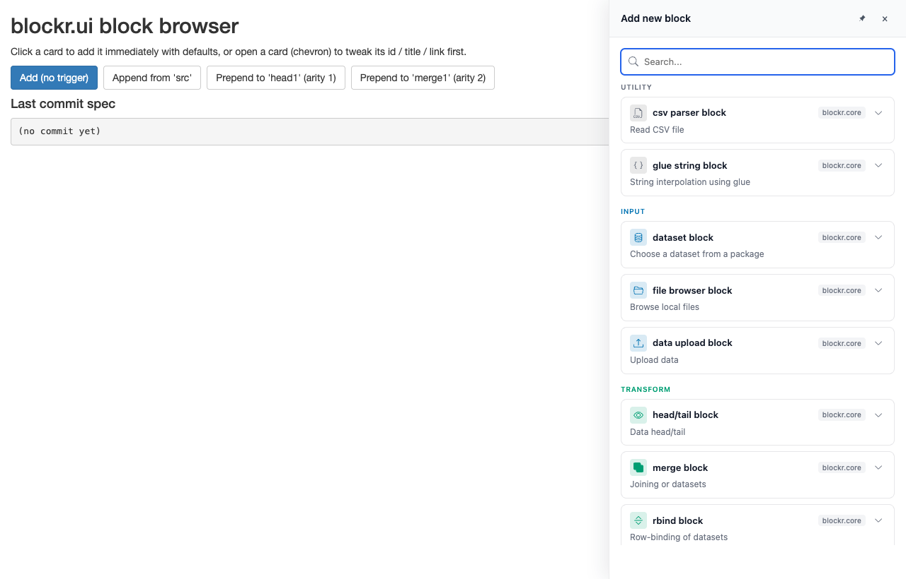
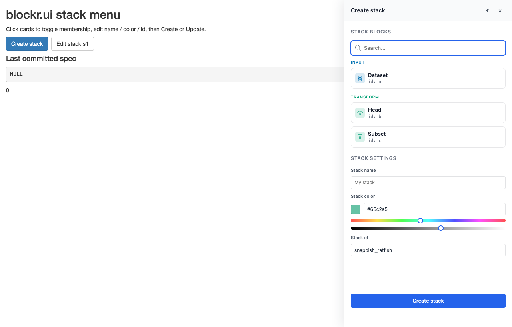
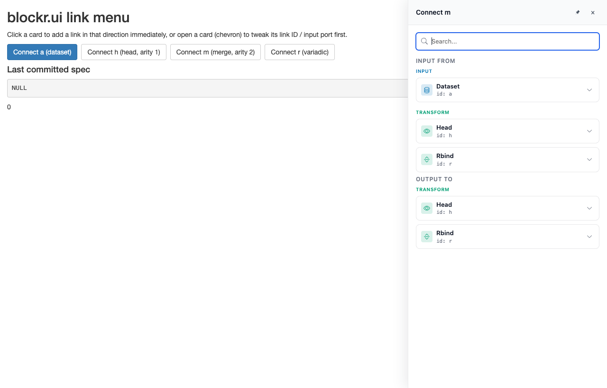

# blockr.ui

User-interface primitives shared across the
[blockr](https://blockr.site/) ecosystem. Designed to sit between
`blockr.core` and renderers such as `blockr.dock`.

## Installation

You can install the development version of blockr.ui from
[GitHub](https://github.com/BristolMyersSquibb/blockr.ui) with:

``` r

# install.packages("pak")
pak::pak("BristolMyersSquibb/blockr.ui")
```

## Example

### Minimal sidebar

A slide-in panel that hosts arbitrary Shiny content. See
[`vignette("sidebar", package = "blockr.ui")`](https://bristolmyerssquibb.github.io/blockr.ui/articles/sidebar.md)
for the full API.

``` r

library(shiny)
library(blockr.ui)

ui <- fluidPage(
  titlePanel("blockr.ui sidebar primitive"),
  actionButton("open", "Open sidebar", class = "btn-primary"),
  verbatimTextOutput("state"),
  sidebar_ui("main_sidebar")
)

server <- function(input, output, session) {
  observeEvent(input$open, {
    show_sidebar(
      "main_sidebar",
      title = "Add a new block",
      ui = tagList(
        textInput("block_name", "Name"),
        selectInput(
          "block_kind",
          "Type",
          c("data", "transform", "plot")
        ),
        actionButton("confirm", "Add", class = "btn-primary")
      )
    )
  })

  observeEvent(input$confirm, {
    hide_sidebar("main_sidebar")
  })

  output$state <- renderPrint({
    state <- input$main_sidebar
    if (is.null(state)) return("sidebar: not yet rendered")
    sprintf(
      "sidebar: open = %s, pinned = %s",
      state$open, state$pinned
    )
  })
}

shinyApp(ui, server)
```


blockr.ui minimal sidebar example

### Block browser

A card-list block picker (one card per row of
[`blockr.core::available_blocks()`](https://bristolmyerssquibb.github.io/blockr.core/reference/register_block.html))
designed to mount inside the sidebar. See
[`vignette("block-browser", package = "blockr.ui")`](https://bristolmyerssquibb.github.io/blockr.ui/articles/block-browser.md).

``` r

library(shiny)
library(blockr.ui)
library(blockr.core)

board <- new_board(
  blocks = list(
    src    = new_dataset_block(),
    head1  = new_head_block(),
    merge1 = new_merge_block()
  )
)

ui <- fluidPage(
  titlePanel("blockr.ui block browser"),
  tags$p(
    "Click a card to add it immediately with defaults, or open a card",
    " (chevron) to tweak its id / title / link first."
  ),
  div(
    style = "display: flex; gap: 8px; margin-bottom: 8px;",
    actionButton("open_add", "Add (no trigger)", class = "btn-primary"),
    actionButton("open_append", "Append from 'src'"),
    actionButton("open_prepend_h", "Prepend to 'head1' (arity 1)"),
    actionButton("open_prepend_m", "Prepend to 'merge1' (arity 2)")
  ),
  tags$h4("Last commit spec"),
  verbatimTextOutput("commit"),
  sidebar_ui("panel", side = "right", width = "420px")
)

server <- function(input, output, session) {
  last_commit <- reactiveVal(NULL)
  added <- blockr.ui::block_browser_server("browser")

  open_browser <- function(title, target = NULL) {
    show_sidebar(
      "panel",
      title = title,
      ui = blockr.ui::block_browser_ui(session$ns("browser"), board, target)
    )
  }

  observeEvent(input$open_add, open_browser("Add new block"))
  observeEvent(input$open_append, open_browser("Append", append_to("src")))
  observeEvent(input$open_prepend_h, open_browser("Prepend", prepend_to("head1")))
  observeEvent(input$open_prepend_m, open_browser("Prepend", prepend_to("merge1")))

  observeEvent(added(), last_commit(added()))
  output$commit <- renderPrint(last_commit() %||% "(no commit yet)")
}

shinyApp(ui, server)
```



blockr.ui block browser example

### Stack menu

A multi-select card-list block picker for stacks, with an inline hue /
lightness colour picker and a panel-level form for the stack name /
colour / id. See
[`vignette("stack-menu", package = "blockr.ui")`](https://bristolmyerssquibb.github.io/blockr.ui/articles/stack-menu.md).

``` r

library(shiny)
library(blockr.ui)
library(blockr.core)

board <- new_board(
  blocks = list(
    a = new_dataset_block(),
    b = new_head_block(),
    c = new_subset_block(),
    d = new_scatter_block(),
    e = new_dataset_block()
  ),
  stacks = list(s1 = new_stack(c("d", "e")))
)

ui <- fluidPage(
  titlePanel("blockr.ui stack menu"),
  div(
    style = "display: flex; gap: 8px; margin-bottom: 8px;",
    actionButton("open_create", "Create stack", class = "btn-primary"),
    actionButton("open_edit", "Edit stack s1")
  ),
  verbatimTextOutput("commit"),
  sidebar_ui("panel", side = "right", width = "420px")
)

server <- function(input, output, session) {
  last_commit <- reactiveVal(NULL)
  committed <- blockr.ui::stack_menu_server("menu")

  open_menu <- function(title, target = NULL) {
    show_sidebar(
      "panel",
      title = title,
      ui = blockr.ui::stack_menu_ui(session$ns("menu"), board, target)
    )
  }

  observeEvent(input$open_create, open_menu("Create stack"))
  observeEvent(input$open_edit, open_menu("Edit stack s1", target = "s1"))

  observeEvent(committed(), last_commit(committed()))
  output$commit <- renderPrint(last_commit())
}

shinyApp(ui, server)
```



blockr.ui stack menu example

### Link menu

A bidirectional card-list link picker. Right-click any block to add a
link in either direction - the menu shows up to two sections
(`INPUT FROM` / `OUTPUT TO`) based on the anchor’s free-input capacity.
Single click commits one link; the panel stays open across commits via a
live `pool-update` push. See
[`vignette("link-menu", package = "blockr.ui")`](https://bristolmyerssquibb.github.io/blockr.ui/articles/link-menu.md).

``` r

library(shiny)
library(blockr.ui)
library(blockr.core)

board <- new_board(
  blocks = as_blocks(list(
    a = new_dataset_block(),
    h = new_head_block(),
    m = new_merge_block()
  ))
)

ui <- fluidPage(
  sidebar_ui("panel", side = "right", width = "420px"),
  actionButton("open", "Connect a"),
  verbatimTextOutput("spec")
)

server <- function(input, output, session) {
  committed <- link_menu_server("menu")

  observeEvent(input$open, {
    show_sidebar(
      "panel",
      title = "Connect a",
      ui = link_menu_ui(session$ns("menu"), board, anchor = "a")
    )
  })

  output$spec <- renderPrint(committed())
}

shinyApp(ui, server)
```



blockr.ui link menu example

## Code of Conduct

Please note that the blockr.ui project is released with a [Contributor
Code of
Conduct](https://contributor-covenant.org/version/2/1/CODE_OF_CONDUCT.html).
By contributing to this project, you agree to abide by its terms.
